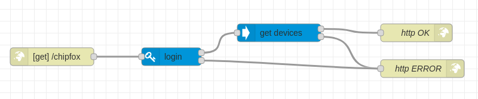

# node-red-chipfox
ChipFox nodes for NodeRed.

This node allows to log in ChipFox's API, list devices and get positions for each device.

## Nodes
Three nodes are included in the package:

* **login**: performs a login in the ChipFox platform. Takes three arguments, all of them mandatory:
 * `Username`
 * `Password`
 * `UUID`: must be provided by ChipFox.

 This node must be run before the others.

* **get devices**: returns a list of devices for the logged user. Takes no arguments.

* **get positions**: returns a list of position for a device. Takes four arguments:
 * `Device ID`: the only mandatory argument.
 * `Limit`: max. number of positions returned.
 * `From`: positions returned are dated after this date.
 * `To`: positions returned are dated before this date.
